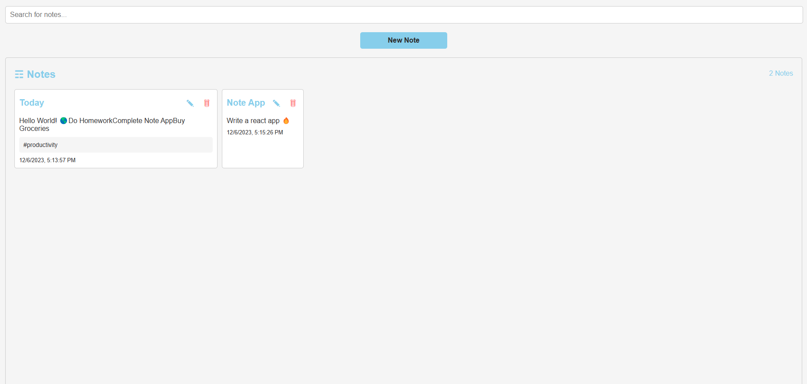
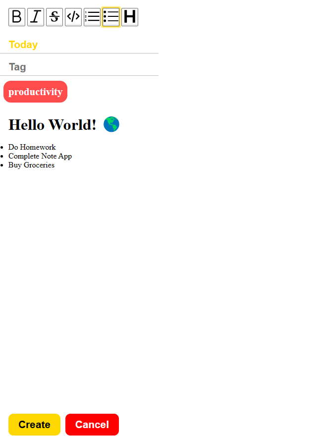

# Note Taking App

This is a note-taking application built using React with TypeScript. The app includes a rich text editor powered by Tiptap, searching functionality to find notes quickly, and the ability to add tags to categorize notes, as well as editing and deleting notes.

[Live Preview](https://super-brioche-bf4e0d.netlify.app/)




## Features

- **Tiptap Editor:** Utilizes the Tiptap editor to provide a rich text editing experience for creating and formatting notes.
- **Searching:** Enables users to search for specific notes based on content or keywords.
- **Tags:** Allows users to add tags to notes for better organization and categorization.
- **Editing and Deleting Notes**
- **Saving Notes to Local Storage**

## Getting Started

To get started with the project, follow these steps:

### Prerequisites

- Node.js and npm installed on your machine.

### Installation

1. Clone the repository:

2. Navigate to the project directory:

```bash
  cd Note-Application

```

3. Install dependencies:

```bash
  npm install

```

4. Run the App:

```bash
  npm run dev

```

## Usage

- Creating a Note: Click on the "New Note" button to create a new note. Use the Tiptap editor to format the content as needed.
- Searching for Notes: Utilize the search bar to find notes based on content or keywords.
- Adding Tags: While creating or editing a note, add tags to categorize and organize your notes efficiently.
- Press on the delete button to delete the note.

## Technologies Used

- React
- TypeScript
- Tiptap Editor
